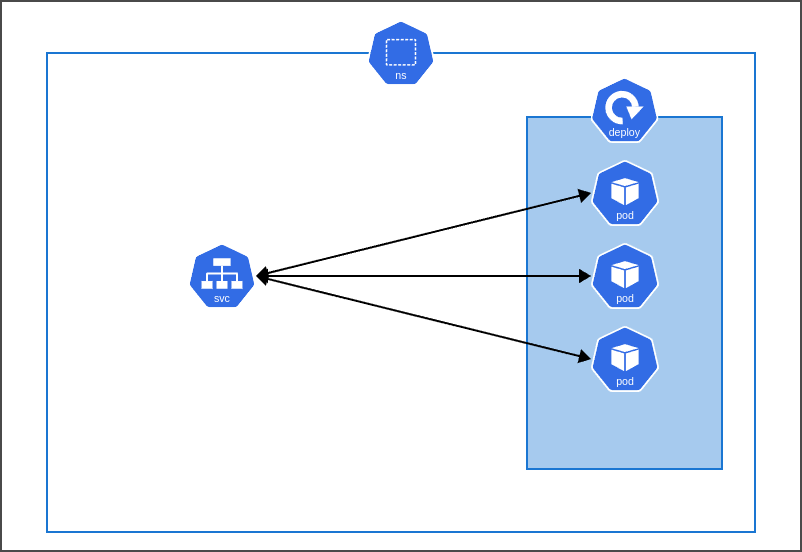

# k8s Project: Basic Web App Deployment with Terraform

Hi everyone,
I have been learning Kubernetes for a few days, so I wanted to make some practice with Kubernetes and deployed a basic web application into a **minikube** cluster. I also used Terraform as the IaC tool which means all the deployment has done with Terraform. 

Feel free to take a look at the code! If you want to help me on my Terraform journey, for instance making my Terraform code better, reach me from the links on my profile. Any help is appreciated!

> [!WARNING]
> `provider.tf` file is configured for **minikube**. You may need to change the configuration.
